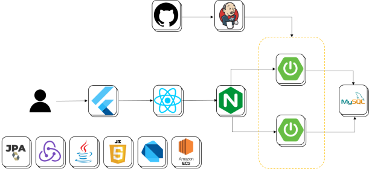
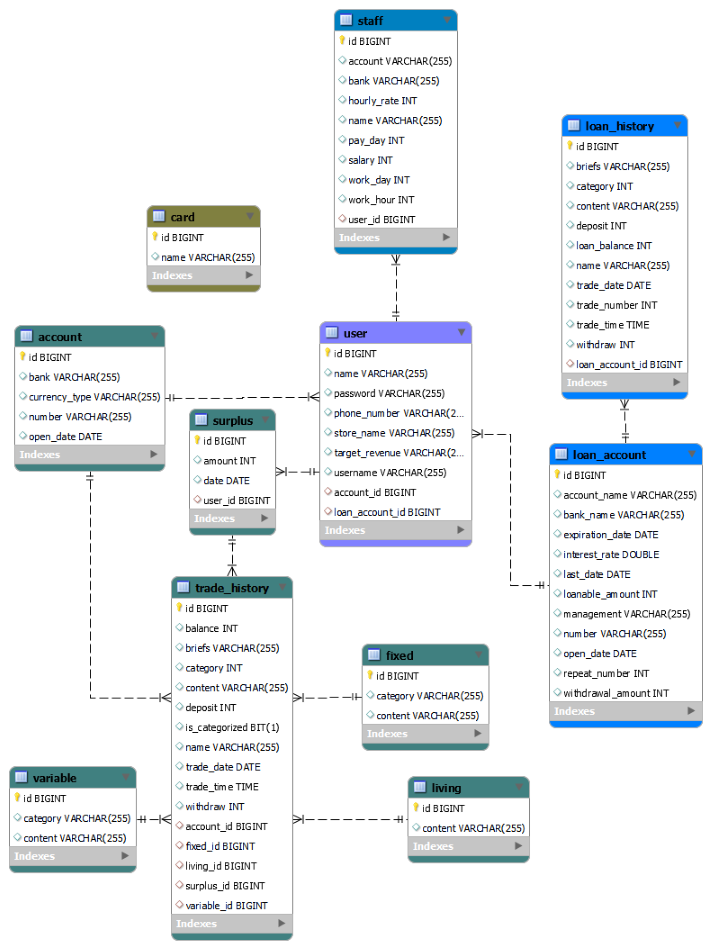

# 🏫 SOLUP

 

  <h3>돈 관리에 어려움을 겪는 소상공인들을 위한 손익 관리 솔루션 서비스</h3>

## ⌨️ 기간

- **2023.09.01 ~ 2023.09.17**

 

## 🔎 목차

1. <a href="#subject">🎯 주제</a>
1. <a href="#mainContents">⭐️ 주요 기능</a>
1. <a href="#systemArchitecture">⚙ 시스템 아키텍쳐</a>
1. <a href="#skills">🛠️ 기술 스택</a>
1. <a href="#erd">💾 ERD</a>
1. <a href="#developers">👥 팀원 소개</a>

 

<!------- 주제 시작 -------->

## 🎯 주제

**SOLUP**은 소상공인들을 위한 거래내역 기반의
손익 관리 솔루션 서비스

**주요 기능**

- 지출 분류
- 매출 분석

<a href="#tableContents">목차로 이동</a>

 

<!------- 주요 기능 시작 -------->

## ⭐️ 주요 기능

### 지출 분류

<h4> 고정비, 변동비 등 지출 내역을 분류합니다.</h4>

---

### 매출 분석

<h4>가계부를 만들고 소비 패턴을 확인할 수 있습니다.</h4>

---

## 🌟 주요 차별점

### 계좌 분할 없이 지출 관리

<h4>사업 운영에 필요한 고정비, 변동비, 예비비, 그리고 카
드와 현금으로 이루어진 매출을 계좌 분할 없이 관리합니다.</h4>

<a href="#tableContents">목차로 이동</a>

 

<!------- 시스템 아키텍쳐 시작 -------->

## ⚙ 시스템 아키텍쳐

<a href="#tableContents">목차로 이동</a>

 

<!------- 기술 스택 시작 -------->

## 🛠️ 기술 스택

### 프론트

---

### 백엔드

### 인프라

---

### 협업

<a href="#tableContents">목차로 이동</a>

 

<a href="#tableContents">목차로 이동</a>

 

<!------- ERD 시작 -------->

## 💾 ERD

<a href="#tableContents">목차로 이동</a>

 

<a href="#tableContents">목차로 이동</a>

 

## 👥 팀원 소개

| **Name** |   박진희   |   노창현   | 정현우 | 최동우 |
| :------: | :--------: | :--------: | :----: | :----: |
| **역할** | 프론트엔드 | 프론트엔드 | 백엔드 | 백엔드 |
